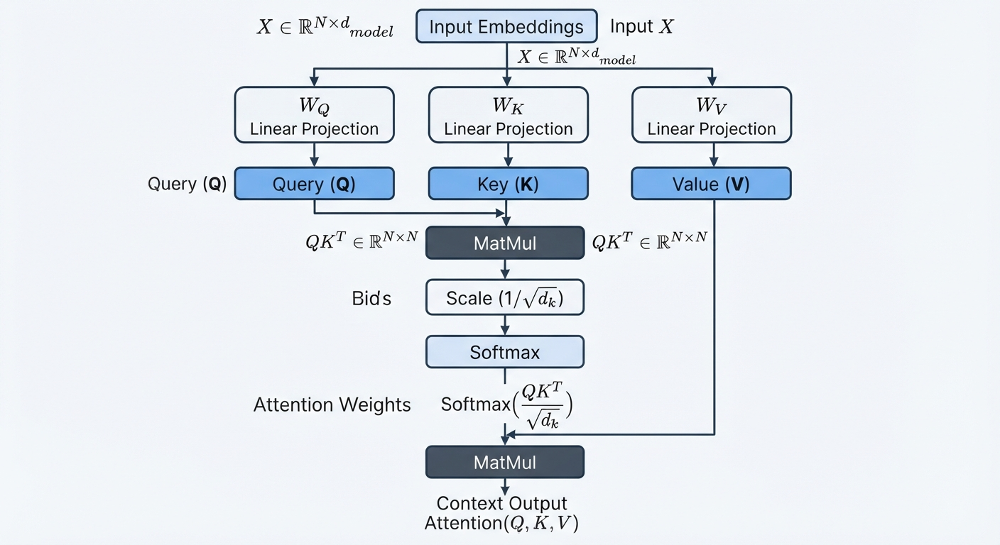
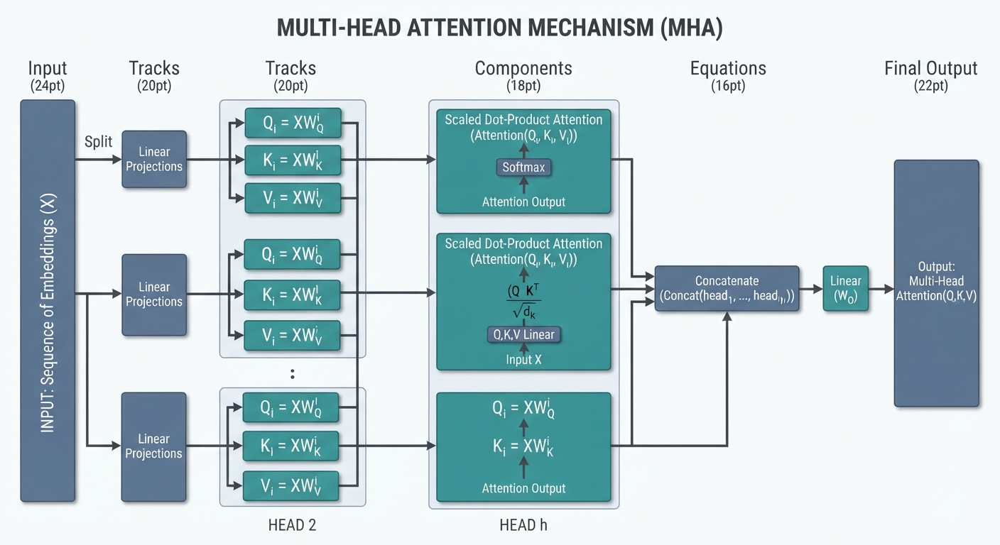

# Demystifying Self-Attention in Transformer Architectures: A Developer's Guide

## The Intuition: Moving Beyond Sequential Recurrence

Recurrent Neural Networks (RNNs) and LSTMs process sequences token-by-token. This sequential dependency creates a significant computational bottleneck; because each hidden state depends on the previous one, you cannot parallelize computation across the time dimension. As sequences grow, the architectural overhead of passing hidden states becomes a latency anchor. Transformers discard this recurrence entirely, utilizing matrix multiplications that allow modern GPUs to process all tokens in a sequence simultaneously.

In neural architectures, the 'receptive field' defines the extent of input data a unit can "see" to produce an output. RNNs suffer from a limited effective receptive field, often struggling to retain long-range dependencies due to vanishing gradients over time. Conversely, self-attention grants a global receptive field in a single layer. Every token interacts directly with every other token, regardless of distance, allowing the model to capture distant relationships instantly.

Consider the sentence: "The bank of the river is muddy, so I sat on the bank." Self-attention enables 'soft alignment,' where the model assigns varying attention weights to words. When processing the second "bank," the mechanism dynamically contextualizes it by attending strongly to "river" rather than other irrelevant tokens. This creates a rich, context-aware representation that RNNs could only approximate through complex, long-path state updates.

## The Mathematical Engine: Queries, Keys, and Values

To understand self-attention, visualize an information retrieval system. Each token in a sequence projects itself into three distinct roles: 
* **Queries (Q):** Represents the "search" intent—what this token is looking for in other tokens.
* **Keys (K):** Acts as the index or label, describing the content each token offers to others.
* **Values (V):** The actual information content that will be aggregated once a relationship is established.

The mechanism computes a score by calculating the dot product of a query with all keys. This quantifies the relevance of each token to the current context.

Because dot products grow large in magnitude as dimensionality ($d_k$) increases, we must scale the scores by $1/\sqrt{d_k}$. Without this scaling factor, the dot product results enter the regions of the softmax function where gradients are extremely small. This "gradient vanishing" effect would effectively halt the learning process during backpropagation. By normalizing the variance, we ensure the model maintains stable gradient flow.

Following this, we apply a softmax to convert these scores into a probability distribution (weights), which are then multiplied by the Value (V) matrix to produce the final representation.


*Figure 1: Graphical breakdown of the Scaled Dot-Product Attention mechanism, tracing the path from input embeddings through projection matrices to final context-rich outputs.*

The following NumPy snippet demonstrates this core computation:

```python
import numpy as np

def scaled_dot_product_attention(q, k, v):
    d_k = k.shape[-1]
    # Compute raw attention scores
    scores = np.matmul(q, k.transpose(-2, -1)) / np.sqrt(d_k)
    # Convert to probability weights
    weights = np.exp(scores) / np.sum(np.exp(scores), axis=-1, keepdims=True)
    # Weighted sum of values
    return np.matmul(weights, v)

# Dummy tensors: (batch, seq_len, d_model)
Q = np.random.randn(1, 4, 8)
K = np.random.randn(1, 4, 8)
V = np.random.randn(1, 4, 8)

output = scaled_dot_product_attention(Q, K, V)
```

## Implementing Single-Head Attention in PyTorch

To implement self-attention, we project input embeddings into three distinct subspaces: Query (Q), Key (K), and Value (V). We initialize these as linear layers, where `d_model` represents the input dimension and `d_k` the head dimension.

```python
import torch
import torch.nn as nn
import torch.nn.functional as F

class SingleHeadAttention(nn.Module):
    def __init__(self, d_model, d_k):
        super().__init__()
        self.d_k = d_k
        self.w_q = nn.Linear(d_model, d_k, bias=False)
        self.w_k = nn.Linear(d_model, d_k, bias=False)
        self.w_v = nn.Linear(d_model, d_k, bias=False)

    def forward(self, x):
        # x shape: (batch_size, seq_len, d_model)
        q, k, v = self.w_q(x), self.w_k(x), self.w_v(x)
        
        # Scale dot-product: (B, L, d_k) @ (B, d_k, L) -> (B, L, L)
        scores = torch.bmm(q, k.transpose(-2, -1)) / (self.d_k ** 0.5)
        attn = F.softmax(scores, dim=-1)
        
        # Context extraction: (B, L, L) @ (B, L, d_k) -> (B, L, d_k)
        return torch.bmm(attn, v)
```

The core of the attention mechanism relies on batched matrix multiplication (`torch.bmm`). By utilizing `bmm`, we perform parallel dot-product calculations across all samples in a batch simultaneously, significantly optimizing throughput compared to iterative loops. The `scores` matrix captures the alignment between every token pair in a sequence, effectively mapping global dependencies.

Maintaining tensor integrity is critical to avoid runtime mismatches. During the forward pass, the input `(batch_size, seq_len, d_model)` is projected into Q, K, and V of shape `(batch_size, seq_len, d_k)`. The transpose of the Key tensor—`k.transpose(-2, -1)`—results in `(batch_size, d_k, seq_len)`, which facilitates the matrix multiplication with the Query. This yields an attention weight matrix of `(batch_size, seq_len, seq_len)`. Finally, multiplying these weights by V preserves the `d_k` feature dimension, ensuring the output remains compatible with subsequent layers in the Transformer stack, such as Add & Norm or feed-forward networks. By strictly tracking these dimensions, you ensure the model scales gracefully across varying sequence lengths and batch sizes.

## Handling Edge Cases: Causal and Padding Masks

In Transformer architectures, managing variable-length sequences and maintaining temporal causality is essential for model stability. We achieve this by applying masks to the attention scores before the softmax operation, ensuring the model ignores irrelevant tokens.

To handle sequences of varying lengths, we employ a padding mask. Because batch processing requires fixed-size tensors, we pad shorter sequences with a neutral token. To nullify their influence, we generate a mask where padding positions contain `-1e9` and legitimate tokens contain `0`. Adding this mask to the raw attention scores before softmax effectively forces the probability mass of the padded tokens to zero.

For autoregressive decoders, preventing "look-ahead" leakage is critical. We use a causal (look-ahead) mask—typically a lower-triangular matrix—where the upper-triangular elements are set to `-1e9`. This restricts each token's attention solely to itself and preceding positions, preserving the sequential integrity required for next-token prediction.

Finally, debugging is vital to verify these mechanisms. Visualizing attention heatmaps allows us to confirm that masked indices register as absolute zeros. If you see non-zero weights in the upper triangle of a causal decoder, it indicates a masking failure, likely due to improper broadcast shapes or incorrect data types. By strictly enforcing these masks at the logit level, we guarantee that the softmax operation produces clean, causal probability distributions that respect input boundaries.

## Scaling up to Multi-Head Attention (MHA)

While single-head attention provides a mechanism to weigh the importance of input tokens, it forces the model to settle for a single "consensus" view of the sequence. Multi-Head Attention (MHA) solves this bottleneck by projecting the Queries, Keys, and Values into $h$ distinct representation subspaces. Empirically, this allows the model to attend to different aspects of the data simultaneously—for instance, one head might specialize in syntactic dependencies while another focuses on semantic associations or coreference resolution. By running these projections in parallel, we prevent the model from being limited to a single, static distribution of attention scores.

To implement MHA efficiently in PyTorch, we avoid explicit loops, preferring tensor reshaping and transposition. We partition the embedding dimension $d_{model}$ into $h$ heads, where each head has dimension $d_k = d_{model} / h$.


*Figure 2: Multi-Head Attention architecture showing how input embeddings are projected into multiple subspaces, processed in parallel, concatenated, and projected back to the original dimension.*

```python
import torch
import torch.nn as nn

class MultiHeadAttention(nn.Module):
    def __init__(self, d_model, num_heads):
        super().__init__()
        assert d_model % num_heads == 0
        self.d_k = d_model // num_heads
        self.num_heads = num_heads
        
        self.w_q = nn.Linear(d_model, d_model)
        self.w_k = nn.Linear(d_model, d_model)
        self.w_v = nn.Linear(d_model, d_model)
        self.fc_out = nn.Linear(d_model, d_model)

    def forward(self, x):
        batch_size, seq_len, _ = x.size()
        
        # Linear projections and reshape to (batch, heads, seq_len, d_k)
        q = self.w_q(x).view(batch_size, seq_len, self.num_heads, self.d_k).transpose(1, 2)
        k = self.w_k(x).view(batch_size, seq_len, self.num_heads, self.d_k).transpose(1, 2)
        v = self.w_v(x).view(batch_size, seq_len, self.num_heads, self.d_k).transpose(1, 2)
        
        # Scaled Dot-Product Attention logic applied to all heads concurrently
        scores = torch.matmul(q, k.transpose(-2, -1)) / (self.d_k ** 0.5)
        attn = torch.softmax(scores, dim=-1)
        out = torch.matmul(attn, v)
        
        # Merge heads: concatenate and project back to d_model
        out = out.transpose(1, 2).contiguous().view(batch_size, seq_len, -1)
        return self.fc_out(out)
```

The transformation sequence is critical: we use `view` to separate the head dimension, then `transpose(1, 2)` to bring the head dimension into the batch position. This allows the matrix multiplication to treat each head as an independent batch item. After calculating attention, we transpose back and use `contiguous()` to flatten the tensors, ensuring they can be merged. Finally, the concatenated output is passed through a linear projection layer (`fc_out`) to blend the information from all heads back into the original embedding dimension.

## Performance Optimization and Hardware Bottlenecks

The self-attention mechanism is defined by the calculation of the attention matrix $A = \text{softmax}(\frac{QK^T}{\sqrt{d_k}})V$. As the input sequence length $N$ grows, the computation of the $N \times N$ attention matrix imposes a quadratic $O(N^2)$ burden on both time and memory. This scaling creates a significant bottleneck on modern GPUs, where high-speed on-chip SRAM is insufficient to hold the full attention matrix, forcing the hardware to rely on slower HBM (High Bandwidth Memory). Consequently, memory bandwidth—rather than raw FLOPs—often becomes the primary constraint during model training and long-context inference.

To address these inefficiencies, standard softmax evaluation must be replaced with memory-aware strategies. The core problem with standard attention is that it writes the massive $N \times N$ matrix to HBM before reading it back for the weighted sum. FlashAttention mitigates this through a tiling approach, which decomposes the attention matrix into smaller blocks that fit within the GPU’s fast SRAM. By recomputing parts of the softmax denominator during the backward pass, FlashAttention avoids storing the full matrix, significantly reducing HBM read/write operations and accelerating training times.

During inference, developers must balance the performance gains of KV-Caching against memory footprint expansion. KV-Caching stores the previously computed keys and values for each token to avoid redundant calculations across autoregressive steps. While this caching reduces the computational complexity of generating the next token from $O(N^2)$ to $O(N)$, it consumes vast amounts of VRAM as sequences grow. For large models, this creates a trade-off: keeping the cache active enables high-throughput generation, but it forces smaller batch sizes, potentially leading to underutilized compute resources. Strategies like PagedAttention or quantization are often required to reclaim this overhead.